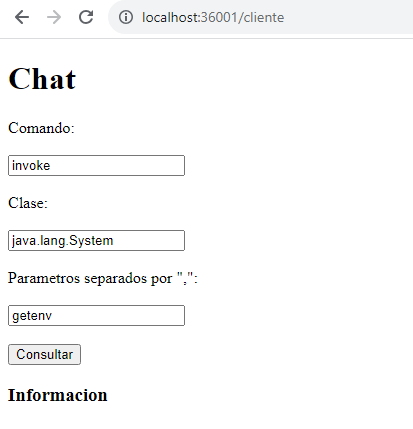

# Parcial Corte 1: construir un "Reflective ChatGPT"
## Angie Natalia Mojica Diaz

### Descripción

Usted debe construir un "Reflective ChatGPT". La solución consta de un servidor backend que responde a solicitudes HTTP GET de la Facade, un Servidor Facade que responde a solicitudes HTTP GET del cliente  y un cliente Html+JS que envía los comandos y muestra las respuestas. El api permite explorar clases del API de java. Cuando el usuario solicita información de una clase el chat le responde con el nombre de la clase, la lista de los campos declarados en la clase y la lista de los métodos declarados en la clase. Además el API debe permitir invocar y mostrar la salida de métodos estáticos con 0, 1 o 2 parámetros. Los parámetros de entrada pueden ser numéricos o Strings.

### Solución

Se ha implementado un servidor 'HttpServer' que atiende las solicitudes de Facade y un servidor 'Facade' que atiende las solicitudes del cliente. El servidor 'HttpServer' se encarga de recibir las solicitudes de la Facade y responder con la información de la clase solicitada. El servidor 'Facade' recibe las solicitudes del cliente y las envía al servidor 'HttpServer' para obtener la información de la clase solicitada.

Se ha implementado en su totalidad la logica pero queda un error de respuesta del servidor por investigar, para ejecutar el programa se debe correr el servidor 'HttpServer' y el servidor 'Facade' y luego ingresar a  en un navegador. [Index](localhost:36001/index.html)